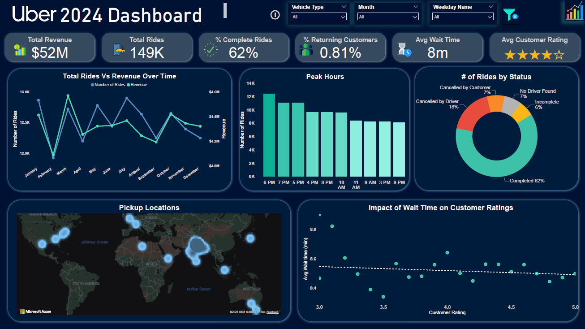
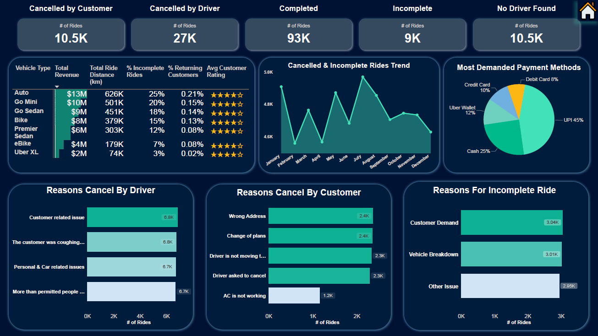

# 🚖 Uber Data Analytics Dashboard  

  

---
## 📌 Project Overview  
This project analyzes Uber ride data to uncover business insights and visualize performance metrics.  
It was developed in **two stages**:  

1. **Data Modeling in SQL (PostgreSQL / pgAdmin)**  
   - Cleaned and prepared raw booking, customer, and vehicle data.  
     

2. **Interactive Dashboard in Power BI**  
   - Imported SQL results into Power BI.  
   - Designed an  dashboard with dynamic slicers, KPIs, and interactive charts.  

---

## 🗄️ Dataset  
The dataset [(view here)](ncr_ride_bookings.csv) includes booking and customer information with fields such as:  
- **Booking ID, Customer ID, Vehicle Type, Booking Status**  
- **Booking Time, Ride Distance, Payment Method**  
- **Customer Ratings, Revenue, Wait Time**  

*(the Dataset is from Kaggle [you can view it here](https://www.kaggle.com/datasets/yashdevladdha/uber-ride-analytics-dashboard/data))*  

---

## 🎯 Key Features  

### ✅ Data Preparation (SQL)  
- Wrote SQL queries to calculate:  
  - Revenue by month  
  - Number of rides  
  - Completed vs. incomplete rides  
  - Average customer ratings  
  - Types of Payment Methods    

### 📊 Dashboard KPIs (Power BI)  
- **Total Revenue:** $52M  
- **Total Rides:** 149K  
- **% Completed Rides:** 62%  
- **% Returning Customers:** 0.81%  
- **Avg Wait Time:** 8 minutes  
- **Avg Customer Rating:** 4.0 ★★★★☆  

### 📈 Dashboard Visuals  
- **Trend Analysis:** Rides & Revenue over time.  
- **Customer Behavior:** Peak booking hours, impact of wait time on ratings.  
- **Operational Insights:**  
  - Cancellation reasons (by customer & driver).  
  - Incomplete ride trends.  
- **Vehicle Performance Matrix:** Revenue, ride distance, incomplete rate, returning customers, average ratings by vehicle type.  
- **Payment Preferences:** Breakdown by method (UPI, cash, card, wallet).  
- **Geographic View:** Pickup locations (map).  

---

## 🎨 Tech Stack  
- **SQL (PostgreSQL / pgAdmin)** → Data cleaning & aggregation  
- **Power BI** → Data modeling & visualization  
- **Power Query** → Data transformation  
- **DAX** → Custom measures (completion rate, returning customers, KPIs)  

---

## 📷 Screenshots  

### Overview Page  
  

### Detailed Analysis  
  
 

---

## 🔑 Key Insights  
- Driver cancellations (27K rides) were the **largest source of lost rides**.  
- Only **0.81% customers returned**, suggesting **weak customer retention**.  
- Peak booking hours were in the **evening (6–9 PM)**.  
- Longer wait times strongly correlated with **lower ratings**.  
- **Auto & Go Mini** brought in the most revenue, but also had the **highest incomplete ride rates**.  
- **UPI (45%)** was the most popular payment method.  

---
### 👩‍💻 By : Raghad Khudair

This project is part of my learning portfolio as a beginner data science and Analysis. I'm looking forward to building more projects, gaining new skills, and growing in the data field.
> 🌱 Thanks for reading! More projects coming soon — stay tuned. 
